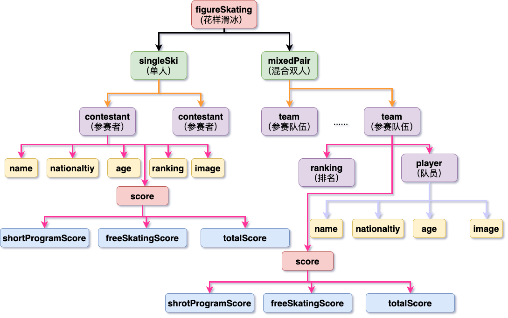
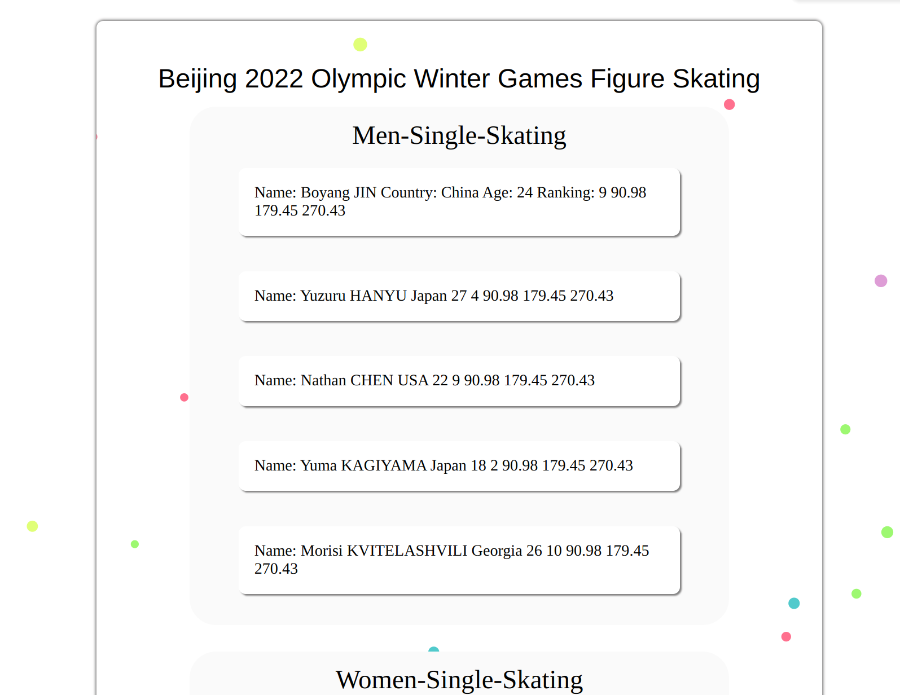

# XML课程作业
> 组名：Dracula
## 第一周作业
* [x] 模型建立
    
* [x] 第一周xml文件
    * [Dracula1_1.xml](./week1/Dracula1_1.xml)

## 第二周作业
* [x] xml文件
    * [Dracula1_2.xml](./week2/Dracula1_2.xml)
* [x] dtd文件
    * [figureSkating.dtd](./week2/figureSkating.dtd)

## 第三周作业
* [x] xml文件
    * [Dracula1_3.xml](./week3/Dracula1_3.xml)
* [x] xsd文件
    * [figureSkating.xsd](./week3/figureSkating.xsd)
* [ ] css文件
    * [x] cupair's
        * [figureSkating.css](./week3/css/cupair/figureSkating.css)
        * effect
            
    * [ ] badbao's
